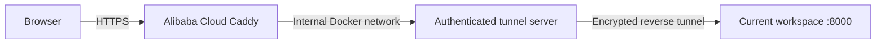

# Deployment

Public URL: **https://convert.lumoren.cn/**
Source: https://github.com/bilbillm/convert

## Where the application runs

Conversion workers and job storage run in this managed workspace at port 8000. Alibaba Cloud is the public HTTPS ingress and tunnel endpoint; it does not process uploaded documents or images.



## DNS and TLS

Alibaba Cloud DNS has an enabled A record: host `convert`, value `47.116.190.234`, TTL 600 seconds. The existing Caddy ingress redirects HTTP to HTTPS and issues/renews the certificate. The additional site configuration is in `deploy/relay.Caddyfile`.

The existing Caddy container is `wmu-campus-wall-portal-edge`. It now also joins a dedicated internal Docker network, `lumo_convert_relay`. Container `lumo-convert-tunnel` listens on ports 19001 and 18000 inside that network. Neither tunnel port is published on the host. The relay has a restart policy, 128 MB memory limit and restricted forwarding credentials. Caddy's earlier configuration is backed up at `/opt/lumo-convert-relay/Caddyfile.before-convert`.

## Workspace processes

The application and Chisel tunnel now run in Docker container `lumo-convert-workspace`, independently of tool execution sessions. Docker uses `restart: unless-stopped`; container PID 1 supervises both children, logs their exits and restarts them after three seconds. The application is restarted after three consecutive failed local health probes. Public HTTPS is probed every 30 seconds and failures are logged. The tunnel reconnects through the inherited proxy with TLS verification and its pinned fingerprint.

```sh
mkdir -p data logs
chmod 700 logs
export CONVERT_PROXY_IP=$(getent ahostsv4 proxy | awk 'NR==1{print $1}')
docker compose -f compose.yaml -f compose.workspace.yaml up --build -d
```

The workspace override preserves existing `data/`, mounts private credentials read-only and writes logs to `logs/`. It uses the combined system CA bundle for the session proxy. Chisel 1.12.0 remains in `.local/bin/chisel`; its publisher checksum was verified. `.secrets/`, `.local/`, uploads, results and logs are excluded from Git and Docker build context.

The generic Compose configuration runs only the application; `compose.workspace.yaml` enables the authenticated tunnel. Neither requires an interactive tool session to remain open. Docker daemon restarts recover the container, but the managed environment itself must stay running. Destruction/recreation of the workspace still requires restoring dependencies, image, data and private tunnel credentials. An intentional `docker stop` suppresses automatic restart until it is explicitly started again.

## Verified

- Local streaming upload larger than 25 MB.
- Actual Markdown to DOCX/PDF, CSV to XLSX, PNG to WebP, PDF to TXT.
- Broken image failure independent of the other jobs.
- ZIP integrity and unsupported file rejection.
- Browser multi-file selection/conversion, desktop and mobile layout.
- DNS resolution, HTTPS health response, and HTTP-to-HTTPS redirect through the public domain.
- Real document/image/sheet conversions and ZIP downloads through the public HTTPS URL.
- Existing blog and portal health checks after the Caddy addition.

Check the running service locally:

```sh
python scripts/check_service.py
```

Check small fixtures through the public domain:

```sh
python scripts/check_service.py --base-url https://convert.lumoren.cn --skip-large
```

These checks create temporary jobs and one-hour results. The optional application Docker configuration validates, but its image build was interrupted by Docker Hub's HTTP 429 rate limit. The active workspace app uses installed conversion components directly.

## Recovery

After workspace recreation, restore `.secrets/` and `.local/bin/chisel` privately and run the Compose command above. For an existing deployment, inspect `docker inspect lumo-convert-workspace` and the private logs before using `docker compose -f compose.yaml -f compose.workspace.yaml up -d`. Check `/api/health` through the public hostname. If the existing Caddy container is recreated by its original Compose project, reconnect it to the dedicated network with `docker network connect lumo_convert_relay wmu-campus-wall-portal-edge`. Normal container/host restarts preserve the connection. Do not change the DNS A record when restarting the workspace: the ingress address remains the same.

To roll back only the Caddy addition, restore the backup into the mounted config file in place, validate and reload Caddy. The relay container and its dedicated network can then be removed after disconnecting Caddy. Preserve the existing site's other networks, volumes and configuration.

## Incident and validation: 2026-09-30

The earlier deployment's app and tunnel were tool-session processes. Both disappeared while the managed environment remained running; the relay recorded the tunnel closing at 08:34:55 UTC, and the site returned 502. They were replaced with container supervision and a Docker restart policy.

Verified after migration: real public Markdown to DOCX/PDF, CSV to XLSX, PNG to WebP, PDF to TXT, independent invalid-image failure, valid ZIP, local upload over 25 MB, request/job correlation, private exception traces, log rotation and permissions. Forced app and tunnel exits recovered automatically. Killing the container supervisor from the outer environment triggered Docker automatic restart and restored HTTPS. Completed job metadata survived app/container restarts.

See [LOGGING.md](LOGGING.md) for logs, limits, incident queries and known visibility boundaries.
